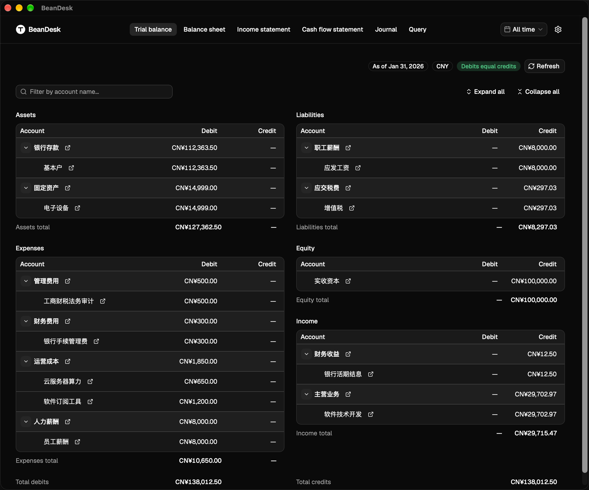
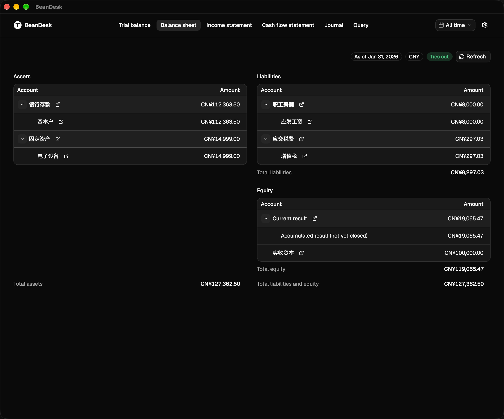
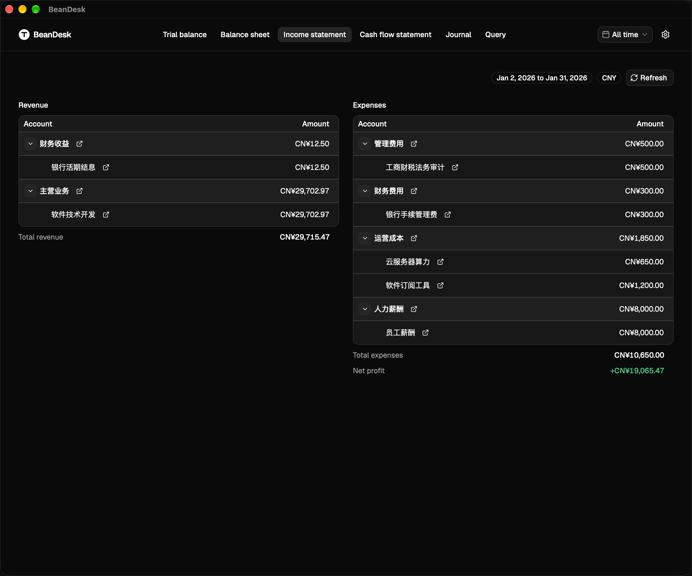
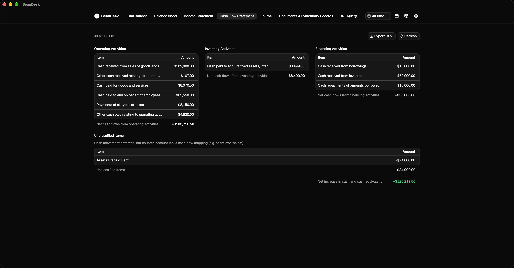
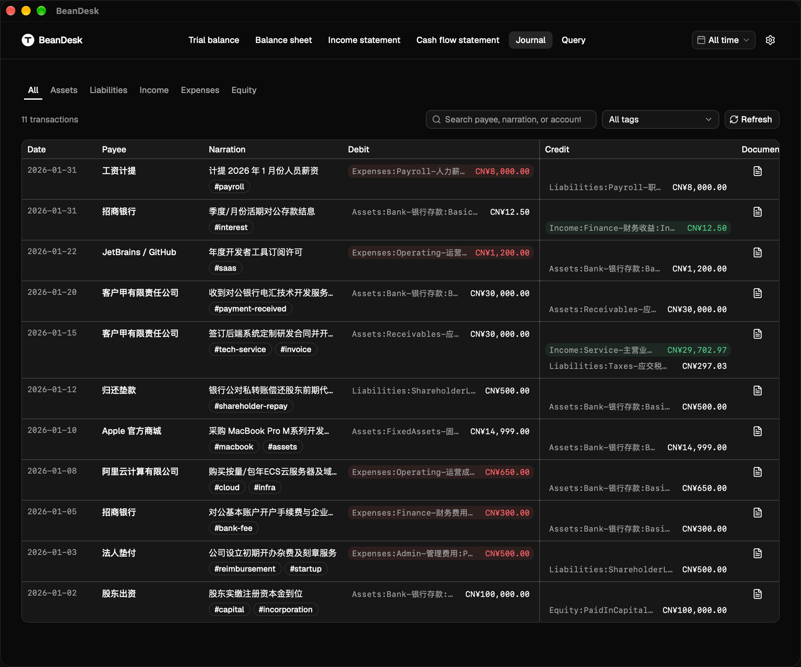
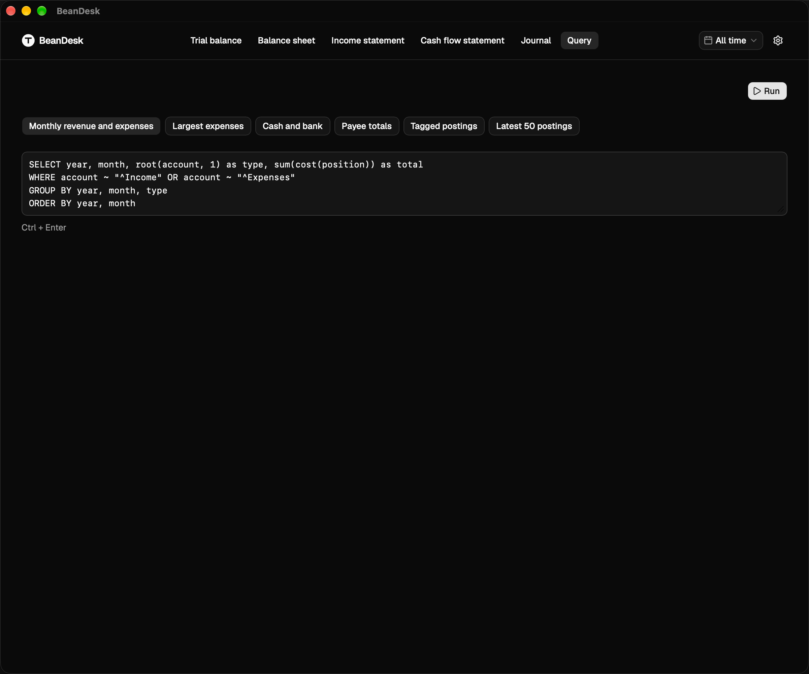
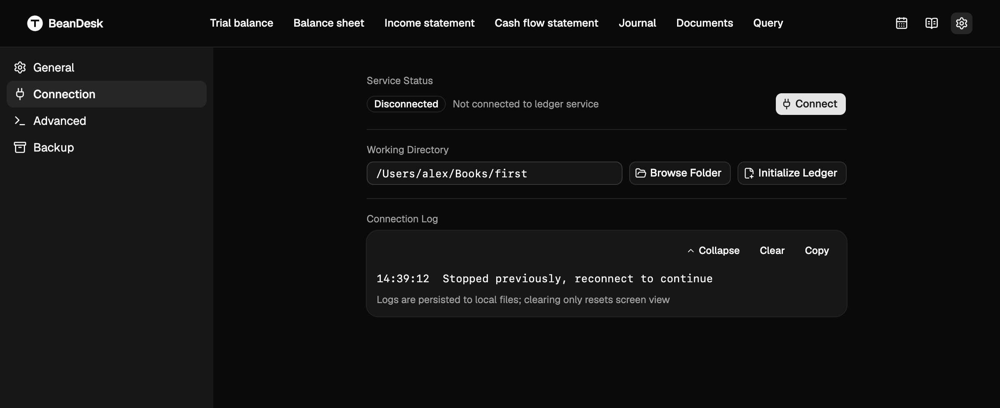

# BeanDesk

A modern financial workbench for Beancount and Fava, built with React 19, TypeScript, Tailwind CSS, shadcn/ui, and Tauri 2. Operates both as a web application and a cross-platform desktop client.

The architecture is analogous to MetaCubeXD for Clash or AriaNg for Aria2: Fava serves as the underlying accounting engine, while BeanDesk acts as an independent presentation and workbench layer communicating directly with a local, private, or remote Fava instance without custom backend services or databases.

**English** | [简体中文](README.zh-CN.md)

[](https://github.com/SuperDaniel-cn/BeanDesk/releases)
[](LICENSE)
[](#sponsorship)



## Quick Start

BeanDesk is a shell around **one** Fava process. Ledger files stay in a folder you choose. We do not host a cloud.

### 1. A ledger service

- **Desktop, first book**: pick a work folder in Settings. Leave the start command empty to use the bundled engine, or create the first `main.bean` skeleton if the folder is empty.
- **Bring your own**: start Fava yourself (`pip install fava`, or your own venv / `make run`) and either paste the address or type that start command.
- **Ask a local agent**:
  > Copy prompt: *"In the folder I name, create a minimal Beancount ledger and start Fava on 127.0.0.1:5000. Do not assume a repo name."*

See the [Fava and Beancount Guide](skills/fava-beancount-guide/SKILL.md).

### 2. Run BeanDesk

- **Desktop (recommended)**: `make desktop`. Start here (folder + empty or custom command) or connect to an address already running Fava.
- **Browser**: only attaches to an existing Fava. `make dev`, then `http://127.0.0.1:5188`.
- **Handbook**: the desktop **Handbook** icon opens a second window with the Fumadocs handbook. `make docs` is the authoring preview at `http://127.0.0.1:3200/docs`.

## Project Positioning and Roadmap

This project delivers a focused financial workbench for Beancount and Fava users, evolving toward compliance support for one-person companies, micro-teams, and solo founders.

Roadmap:

- Phase 1: Universal financial workbench. Complete three statutory statements: Balance Sheet, Income Statement, and direct-method Cash Flow Statement, alongside a side-by-side Trial Balance, global time filtering, and a native BQL console.
- Phase 2: One-person company compliance module. Shareholder loan and advance monitoring to prevent asset commingling and personal liability; tax provision estimates; three-way match checks between contracts, invoices, and bank statements; commercial delivery evidence archive.
- Phase 3: Out-of-the-box desktop client: bundled engine sidecar, first-ledger skeleton, still one Fava. Backup is a local Git snapshot of the work folder, plus optional restic snapshots the user can keep in a folder or their own S3-compatible bucket.

## Feature Boundaries and Non-Goals

To stay a shell around Fava:

- No cloud ledger and no user accounts. The work directory is the user's files. Backup does not use a BeanDesk bucket: local Git, optional restic snapshots, optional upload the user signs with their own S3 keys.
- No app-level vault switcher. Several books are several Fava root files and slugs on **one** service. The desktop window runs as a single instance.
- No built-in accounting engine and no raw Python runtime. Reports ask Fava. A custom start command is not rewritten.
- No web ledger editor. Edit `.bean` files in a desktop editor or via the skill.
- No personal securities or portfolio tracking. Operating books only.
- No charts. Tables only.
- No reminder server and no bundled calendar. The desktop app loads **one** calendar at a time: a local `.ics`, or an HTTPS subscription. Notices fire only while the process is open.

## Features

### Trial Balance
The default landing view. Presents account balances in a classical side-by-side debit and credit layout, verifying that total debits equal total credits across all roots. Supports tree expansion, keyword filtering, and drill-through links to the journal. Highlights imbalances clearly.


### Three Financial Statements

#### Balance Sheet
Two-column layout rendering Fava's closed account tree. Retained period earnings are folded into the equity side, and currency-conversion plugs are excluded.



#### Income Statement
Hierarchically displays operating revenue, expenses, and net profit.



#### Cash Flow Statement
Direct method. Account categories map dynamically via metadata on the ledger's `open` directives: `cash` flags liquid assets, and `cashflow` assigns statutory line items. `cashflow-in` and `cashflow-out` split directional flows on the same account. Zero-balance lines are hidden and non-cash accruals are excluded.



### Global Time Filter
Switches reporting periods from the top navigation bar with support for all-time, annual, quarterly, or monthly filtering. Filter state propagates to the statements, the journal, and the query console.

### Interactive Journal
Provides a dense table view on desktop and card stream on mobile devices. Supports filtering by payee, narration, root account category, and tags. Selecting a transaction opens a dialog with full double-entry postings and document previews. In the desktop client, documents load securely through native byte streams.



### BQL Query Console
Includes query templates, keyboard execution shortcuts, sortable table output, and CSV export. Numeric columns right-align automatically.



### Calendar subscription
BeanDesk is a subscriber, not a reminder host, and it does not ship calendar content. The Calendar page (`/calendar`) shows a month grid and the upcoming list. The source is chosen in the Subscribe calendar dialog, and can be cleared there. It picks one source:

- **Local `.ics`**: a file on this computer. It does not leave the machine.
- **HTTPS ICS**: an address the user pastes. Google Calendar’s secret iCal address or a public `basic.ics`, and Outlook / Microsoft 365 “Publish calendar” links, work. Sign-in pages, CalDAV, and OAuth do not. `webcal://` is stored as `https://`.

The desktop app keeps a local copy and shows it at once. A subscription is checked again after 24 hours (or the interval the feed declares) with a conditional request, or when Refresh is clicked. A failed check keeps the copy.

While the desktop app is open, an event due within 7 days shows one toast and one system banner per UID and occurrence date. Closing the app stops notices. The browser calendar stays empty.

### Local MCP
The same desktop binary speaks MCP on stdio when launched with a bare `mcp` argument (not `--mcp`). Settings → General copies `{ command, args: ["mcp"] }` for a host. The process reads the same `connection.json` as Settings. Tools confirm the work folder, create the first ledger skeleton (`confirmWrite` required), run bean-check, and **read** the live Fava (BQL, statements, journal, documents). Writing entries stays in the work folder. It does not search for a named ledger repository, start Fava, or touch backup or calendar.

### Interface Details
- Mobile slide-out drawer navigation.
- Dark and light theme switching.
- Bilingual support in English and Simplified Chinese.

## Architecture

```
┌────────────────────────────────────────┐
│               Browser                  │
└───────────────────▲────────────────────┘
                    │ http://127.0.0.1:5188 (/api/fava)
┌───────────────────▼────────────────────┐
│         BeanDesk Web (Vite / Caddy)    │
└───────────────────▲────────────────────┘
                    │ /api/fava prefix stripped
                    │
┌───────────────────▼────────────────────┐       Native HTTP Plugin
│               Fava Engine              │ ◄────────────────────── ┌────────────────────────────────────────┐
│         http://127.0.0.1:5000          │                         │        BeanDesk Desktop (Tauri 2)      │
└───────────────────▲────────────────────┘                         │    - Local settings & direct remote    │
                    │                                              │    - Local Fava supervisor lifecycle   │
┌───────────────────┴────────────────────┐                         └────────────────────────────────────────┘
│       User Plain-Text Ledger (.bean)   │
└────────────────────────────────────────┘
```

## Running and Development

### Web Browser Mode

1. Prerequisites:
   - Package manager: Bun 1.1 or higher
   - Accounting engine: Local or private network Fava instance (default address `http://127.0.0.1:5000`)

2. Steps:
   ```bash
   make install
   make dev
   ```
   Open `http://127.0.0.1:5188`. The development proxy forwards `/api/fava` directly to your local Fava instance.

### Desktop Client Mode (Tauri 2)

From the repo root:

```bash
make desktop
```

The desktop shell connects directly to Fava via Tauri's native HTTP layer, bypassing browser CORS and mixed-content restrictions. Settings provides two operation modes:

- **Start here**: Choose the work directory. Leave the command empty for the bundled engine, or type your own (`make run`, `fava a.bean b.bean`). This window starts at most one Fava.
- **Use existing**: Enter an origin that already answers. Private overlay networks (Tailscale, WireGuard) are recommended off-loopback.



The desktop client runs cross-platform on macOS, Windows, and Linux, with built-in update checks and live connection logs. The Calendar page is in the top bar. Local-file and HTTPS sources are desktop only. Local MCP config is on Settings → General (desktop only).

## Deployment and Security Guidelines

Fava's API executes arbitrary BQL queries and serves document files. Never expose the service port directly to a public IP.

Recommended deployment:

1. Loopback binding: Bind Fava and frontend services to 127.0.0.1 without exposing public inbound ports.
2. Remote access:
   - Cloudflare Tunnel and Access: Route traffic through a secure tunnel with email PIN or SSO authentication.
   - Tailscale or WireGuard: Access through a private virtual network restricted to authorized devices.

The bind order, Caddy reverse proxy, and SPA fallback are documented in [DEPLOY.md](DEPLOY.md).

## Directory Structure and Specifications

```
BeanDesk/
├── AGENTS.md               # Frontend engineering standards and agent contract
├── DEPLOY.md               # Loopback bind, Caddy proxy, and tunnel setup
├── docs/                   # User handbook (Fumadocs) and product screenshots
│   └── images/             # Product screenshots (EN & ZH)
├── skills/                 # AI agent skill definitions
│   └── fava-beancount-guide/ # Guide for user-managed ledgers and compliance
├── README.md               # English documentation (default)
├── README.zh-CN.md         # Chinese documentation (简体中文)
├── src-tauri/              # Tauri 2 desktop client shell
└── web/                    # Frontend source code
    ├── package.json
    ├── vite.config.ts
    ├── components.json
    └── src/
        ├── components/     # Reusable UI and layout components
        ├── pages/          # Pages: Trial Balance, Balance Sheet, Income Statement, Cash Flow, Journal, BQL Console
        ├── lib/            # Data adapters, cash flow pure functions, and API clients
        └── i18n/           # Translation catalogues
```

For ledger setup, version compatibility, and bookkeeping guidelines, see the [Fava and Beancount Guide](skills/fava-beancount-guide/SKILL.md). For frontend engineering standards, see [AGENTS.md](AGENTS.md).

## Testing and Building

Run inside the web directory:

```bash
bun test
bun run build
```

## Sponsorship

BeanDesk is free and open-source. If it saves your time, consider supporting its development:

- **Payoneer**: [Support via Payoneer](https://link.payoneer.com/Token?t=D6ADDF769F5F4EE7B8F8F188A32AE50C&src=pl)
- **USDC (Solana)**: `CiZxojzWpKwXqxqbQQ8gN6Qb4pdGSuKzYA9MbX8ukFKK`
- **USDC (Base / Arbitrum / Ethereum)**: `0x43ad55b5fe79d1d8afee3425a6011cfb9a512927`

## License

Licensed under the [GNU Affero General Public License v3.0 (AGPL-3.0)](./LICENSE).

