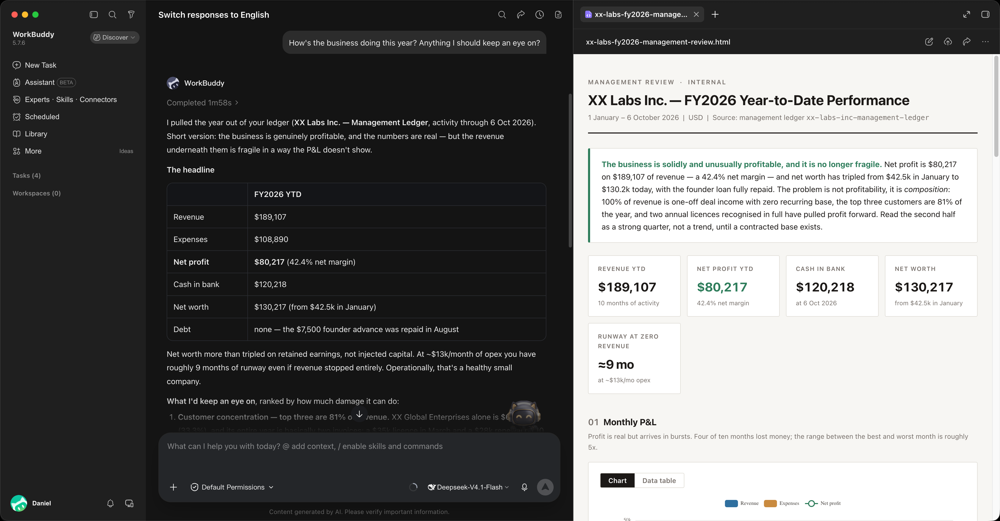

# BeanDesk · Business Ledger

BeanDesk is a local-first double-entry bookkeeping desktop application. It requires no cloud accounts or external databases—your ledger and supporting documents stay entirely on your own machine. Powered by AI agents for automated recording and compliance checks, it generates standardized financial statements with multi-destination encrypted backups.

English | [简体中文](README.zh-CN.md)

## Minimal Daily Workflow

1. Install desktop app
2. Initialize ledger
3. Connect AI
4. Log receipts with AI
5. Review and audit anytime

## Core Features

### Trial Balance & Executive Overview
A single screen summarizing your revenue, expenses, assets, and liabilities. Instantly verifies ledger balance with flexible time filtering by year, quarter, or month.

### Standard Financial Statements
Instant balance sheet, income statement, and cash flow statement, offering a clear view of business performance and cash movements.

### Document Audit Trail & Receipt Verification
Click any transaction in the journal to inspect attached invoices and bank receipts directly, maintaining a verifiable evidentiary trail.

### Custom Queries & AI Analysis
Filter, inspect, and export transaction data to CSV. Use built-in financial query templates or prompt AI agents to extract specific operational metrics.

### Zero Configuration & Data Security
- Ready out of the box: Self-contained runtime requiring no external dependencies; reports refresh automatically as your ledger updates.
- Data sovereignty: No centralized servers; your ledger files and receipts remain strictly on your local machine.
- Dual local and remote backups: Automatic local version snapshots, plus encrypted incremental backups to local drives or S3-compatible cloud storage.
- Due date reminders: Import or subscribe to calendar feeds to receive desktop notifications before critical tax or payment deadlines.

## Quick Start

Download the installer for your operating system from the [Releases](https://github.com/SuperDaniel-cn/BeanDesk/releases) page:

- macOS: Apple Silicon (.dmg) and Intel (.dmg)
- Windows: 64-bit installer (.exe)
- Linux: x86_64 and ARM64 packages (.deb / .AppImage)

After launching the app:
1. New ledger: Select a folder to initialize a standard ledger skeleton with one click
2. Existing ledger: Select your existing ledger directory to open directly
3. Remote connection: Enter the URL of an existing accounting service to connect directly

## Sponsorship

BeanDesk is completely free and open source. If it saves you time or helps your business, sponsorship is greatly appreciated:

- Payoneer (Credit card, debit card, multi-currency): [Sponsor via Payoneer](https://link.payoneer.com/Token?t=D6ADDF769F5F4EE7B8F8F188A32AE50C&src=pl)
- USDC (Solana): `CiZxojzWpKwXqxqbQQ8gN6Qb4pdGSuKzYA9MbX8ukFKK`
- USDC (Base / Arbitrum / Ethereum): `0x43ad55b5fe79d1d8afee3425a6011cfb9a512927`

## License

Licensed under the [GNU Affero General Public License v3.0 (AGPL-3.0)](./LICENSE).
