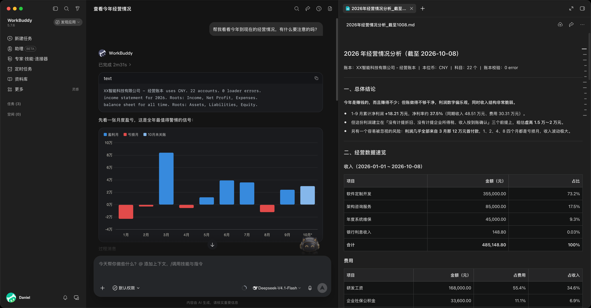
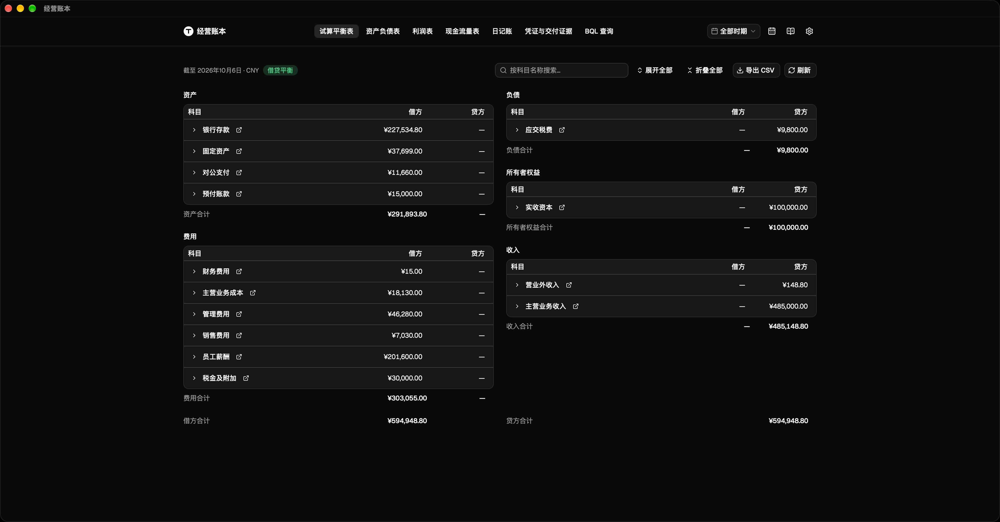
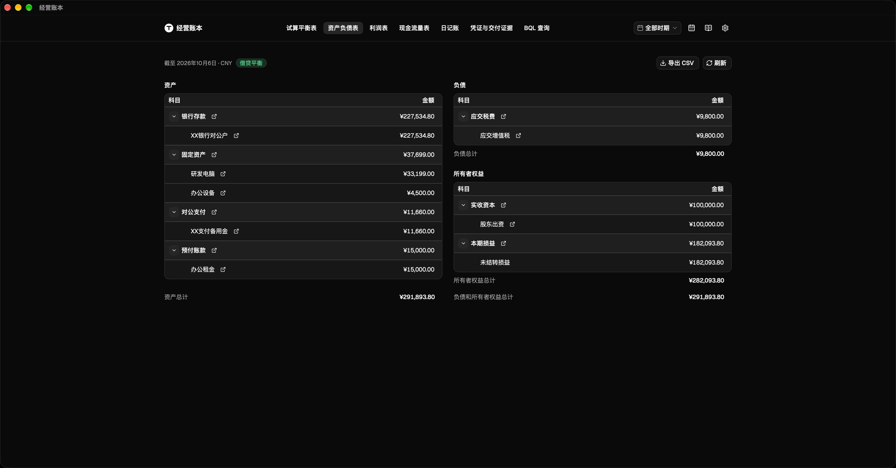
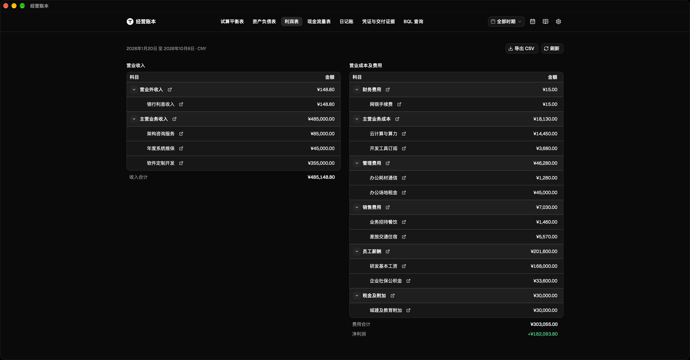
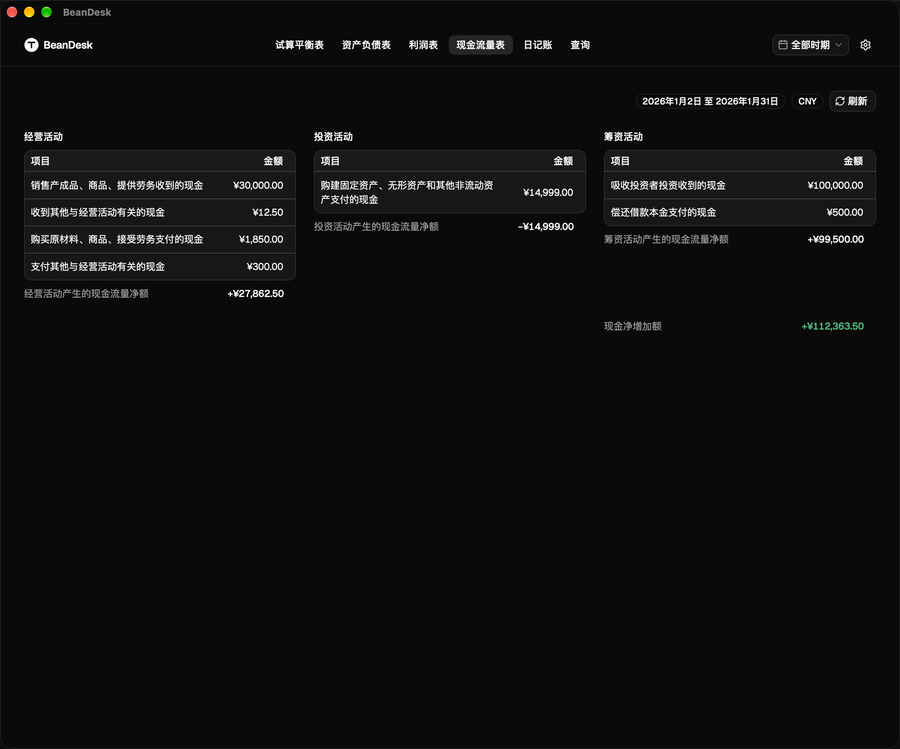
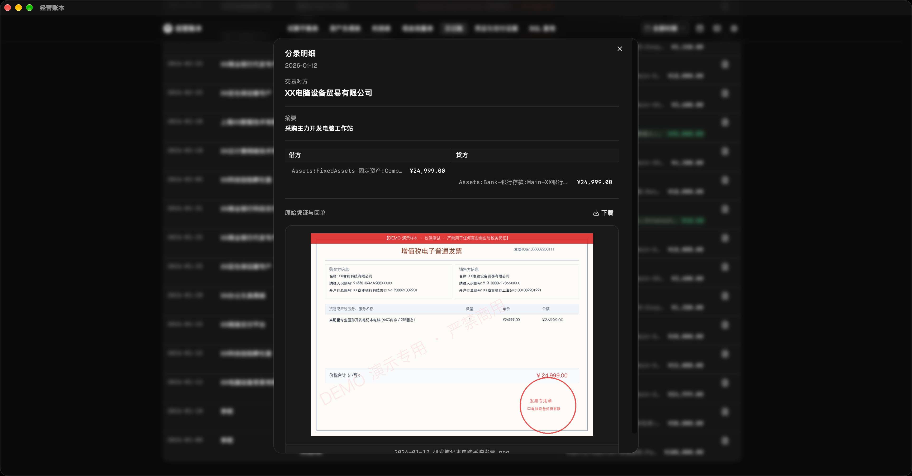
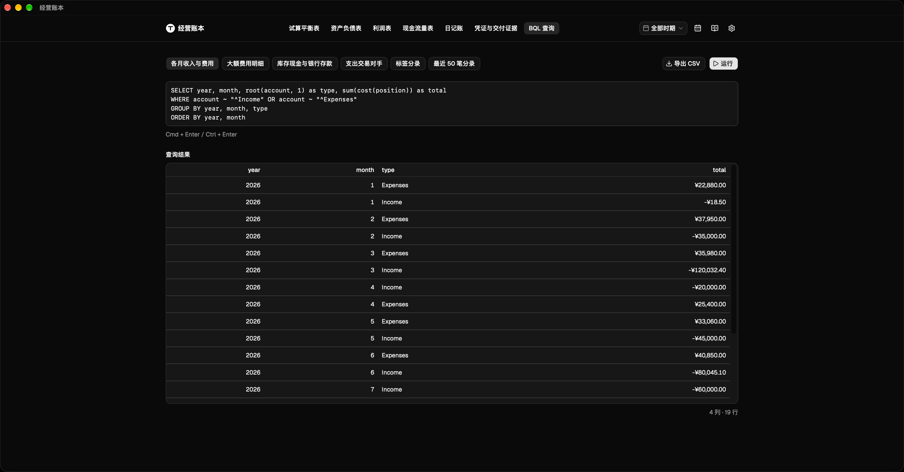
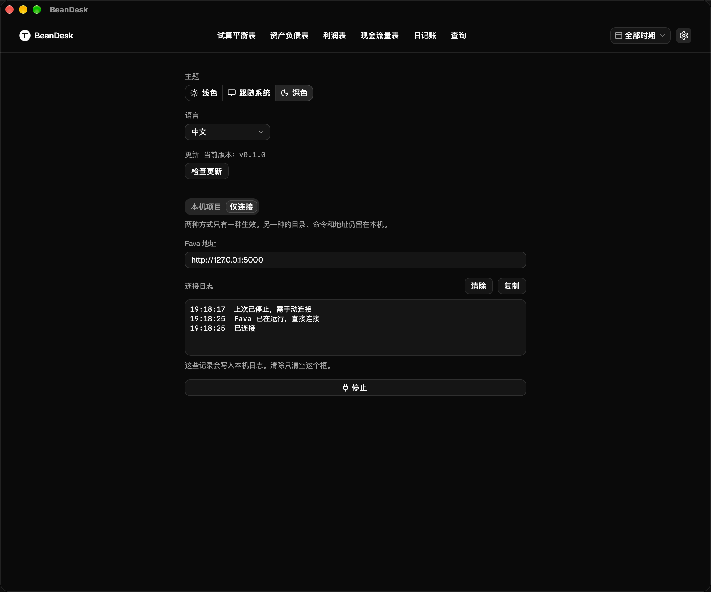

# BeanDesk · 经营账本

BeanDesk 是一款运行在本地的复式记账桌面软件。不设云端账号，无需自建数据库，账目与原始凭证完全由自己保管。软件支持结合 AI 协助日常录账与合规核查，即时生成规范的对公财务报表，并提供多地加密备份。

[English](README.md) | 简体中文

## 极简日常工作流

1. 安装桌面端
2. 初始化账本
3. 连接 AI
4. AI 随手记
5. 随时查账核对

## 核心特性

### 经营大盘与试算平衡
一屏总览企业收支、资产与负债全貌，实时校验账目是否平齐，支持按年度、季度与月份切换查看。

### 标准财务三张表
即时生成资产负债表、利润表与现金流量表，企业经营成果与资金流向一目了然。

### 单据核对与凭证留存
明细账支持直接点击预览关联的发票与银行回单，方便随时核对原始票据，留存完整的记账凭据。

### 灵活查询与 AI 辅助
支持自定义筛选、检索与导出账目，也可以配合 AI 助手快速统计分析各项经营数据。

### 开箱即用与数据安全
- 免环境部署：安装包下载即用，无需额外配置运行环境；账本修改后软件自动同步刷新报表。
- 数据自持：软件不设中心化服务器，账本与凭证文件全部留在自己电脑上，没有托管泄露风险。
- 本地与异地备份：内置本地版本快照，同时支持加密增量备份到其他硬盘或云存储，保障数据安全。
- 日程提醒：支持导入或订阅日历，关键申报或付款节点提前弹出桌面提醒，避免逾期。

## 快速上手

前往 [Releases](https://github.com/SuperDaniel-cn/BeanDesk/releases) 页面下载对应系统的安装包：

- macOS：提供 Apple Silicon（.dmg）与 Intel（.dmg）版本
- Windows：提供 64 位安装包（.exe）
- Linux：提供 x86_64 与 ARM64 的 .deb / .AppImage

打开软件后：
1. 新建账本：选定一个文件夹，一键生成初始账本
2. 已有账本：选择已有的账本目录直接打开
3. 远程连接：填入已有账本服务地址直接连接

## 赞助支持

BeanDesk 完全开源且免费。如果它对你有帮助，欢迎赞助支持后续的维护与更新：

- Payoneer（支持信用卡、借记卡与外币）：[通过 Payoneer 赞助](https://link.payoneer.com/Token?t=D6ADDF769F5F4EE7B8F8F188A32AE50C&src=pl)
- USDC（Solana）：`CiZxojzWpKwXqxqbQQ8gN6Qb4pdGSuKzYA9MbX8ukFKK`
- USDC（Base / Arbitrum / Ethereum）：`0x43ad55b5fe79d1d8afee3425a6011cfb9a512927`

## 许可证

本项目采用 [GNU Affero General Public License v3.0 (AGPL-3.0)](./LICENSE) 开源协议。
